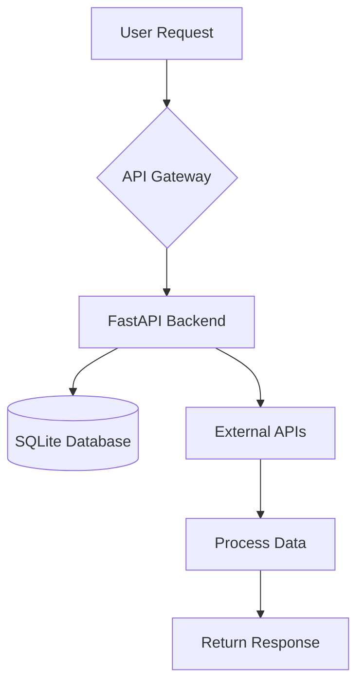
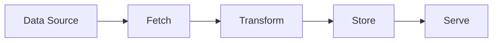

# Documentation Expert

Expert in writing clean, modern, and professional project documentation following best practices.

## README Structure

Organize README files with the following sections:

| Section | Purpose |
|---------|---------|
| **Title + One-liner** | What is this? |
| **Quick Start** | Running in <5 min |
| **Features** | What can I do? |
| **Configuration** | How to customize |
| **API Reference** | Link to detailed docs |
| **Contributing** | How to help |
| **License** | Legal |

## Tech Stack Badges

Use shields.io badges for a modern, professional look:

```markdown


```

Badge format: `https://img.shields.io/badge/{LABEL}-{MESSAGE}-{COLOR}?style=flat&logo={LOGO}&logoColor=white`

## README Template

```markdown
# Project Name

Brief one-line description of what this project does.


## Quick Start

[Minimum steps to run the project]

### Prerequisites

- Python 3.12+
- uv package manager

### Installation

1. Clone the repository
   ```bash
   git clone https://github.com/user/repo.git
   cd repo
   ```

2. Install dependencies
   ```bash
   uv sync
   ```

3. Set up environment variables
   ```bash
   cp .env.example .env
   # Edit .env with your configuration
   ```

4. Run the application
   ```bash
   uv run python src/main.py
   ```

## Features

- Feature 1: Description
- Feature 2: Description
- Feature 3: Description

## Configuration

| Variable | Description | Default |
|----------|-------------|---------|
| `PORT` | Server port | `8000` |
| `DEBUG` | Enable debug mode | `false` |
| `DATABASE_URL` | Database connection string | - |

## Project Structure

[Brief overview of key directories and files]

## Documentation

- [API Reference](./docs/api.md)
- [Architecture](./docs/architecture.md)

## Contributing

1. Fork the repository
2. Create a feature branch (`git checkout -b feature/amazing-feature`)
3. Commit your changes (`git commit -m 'Add amazing feature'`)
4. Push to the branch (`git push origin feature/amazing-feature`)
5. Open a Pull Request

## License

MIT
```

## Flowchart Guidelines

Use Mermaid diagrams to visualize workflows. Place flowcharts after explaining the concept they represent.

### Application Flow Example



### Data Pipeline Example



## API Documentation Template

### Per-Endpoint Format

```markdown
## GET /api/resource/:id

Get a resource by ID.

**Parameters:**

| Name | Type | Required | Description |
|------|------|----------|-------------|
| id | string | Yes | Resource ID |

**Response:**

- `200`: Resource object
- `404`: Resource not found

**Example:**

Request:
```bash
curl -X GET http://localhost:8000/api/resource/123
```

Response:
```json
{
  "id": "123",
  "name": "Example",
  "created_at": "2025-01-01T00:00:00Z"
}
```
```

## Code Comment Guidelines

### When to Comment

| Comment | Do Not Comment |
|---------|----------------|
| Why (business logic) | What (obvious) |
| Complex algorithms | Every line |
| Non-obvious behavior | Self-explanatory code |
| API contracts | Implementation details |

### Python Docstring Template

```python
def function_name(param: str) -> dict:
    """
    Brief description of what the function does.

    Args:
        param: Description of parameter

    Returns:
        Description of return value

    Raises:
        ValueError: When this error occurs

    Example:
        >>> result = function_name("input")
    """
```

### TypeScript JSDoc Template

```typescript
/**
 * Brief description of what the function does.
 *
 * @param paramName - Description of parameter
 * @returns Description of return value
 * @throws ErrorType - When this error occurs
 *
 * @example
 * const result = functionName(input);
 */
```

## Writing Principles

| Principle | Why |
|-----------|-----|
| **Scannable** | Headers, lists, tables |
| **Examples first** | Show, do not just tell |
| **Progressive detail** | Simple to Complex |
| **Up to date** | Outdated = misleading |

## Style Rules

1. **No emojis** in documentation
2. Use **headers** to organize content hierarchically
3. Use **tables** for structured data (configuration, parameters)
4. Use **code blocks** with language hints for syntax highlighting
5. Use **Mermaid diagrams** for workflows and architecture
6. Keep **lines short** for readability
7. Use **absolute paths** for file references within the repository
