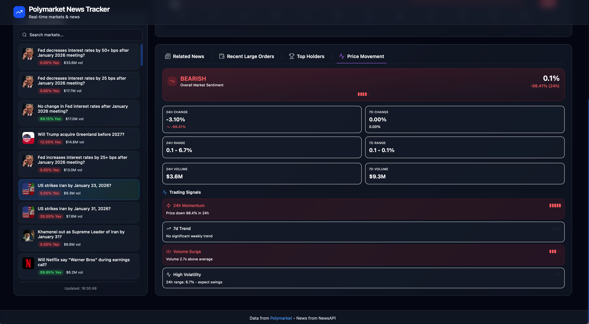
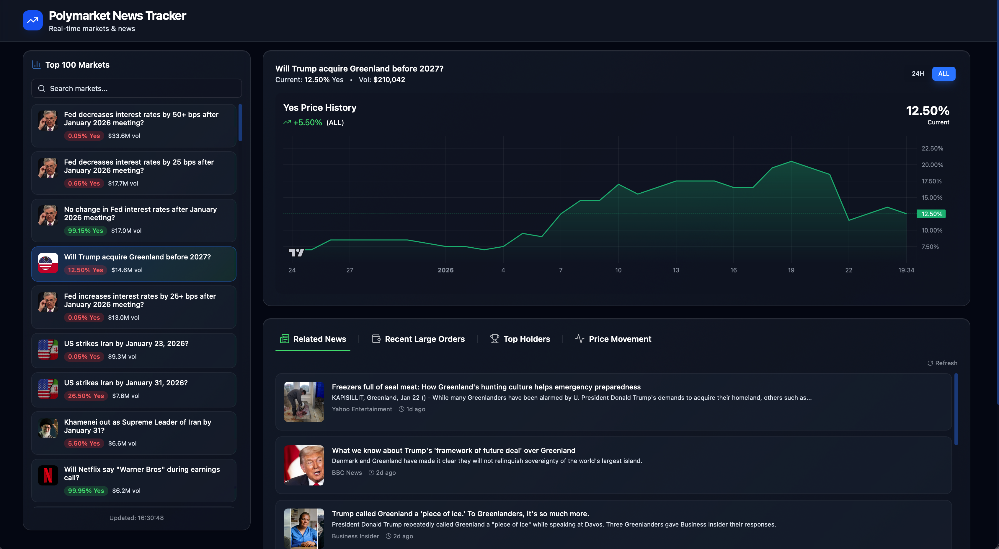
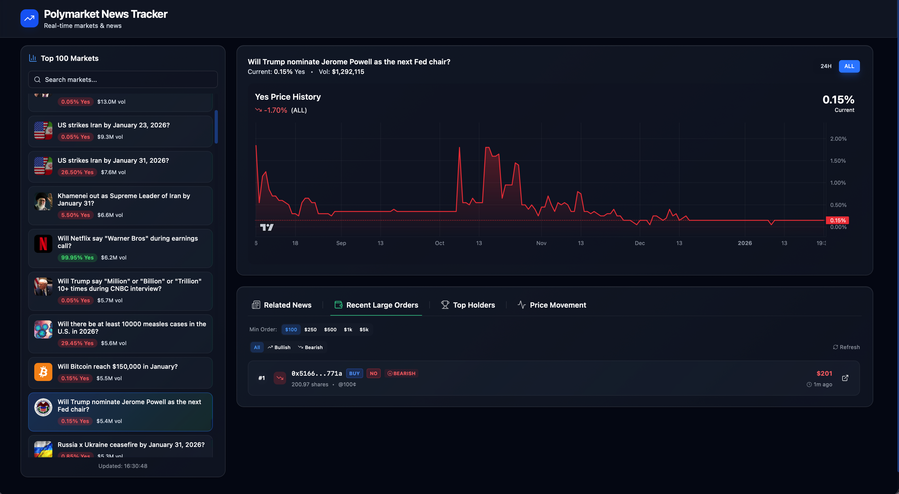
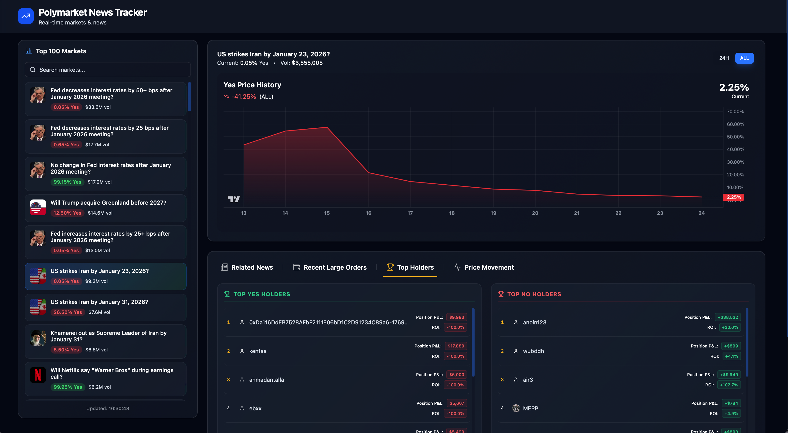
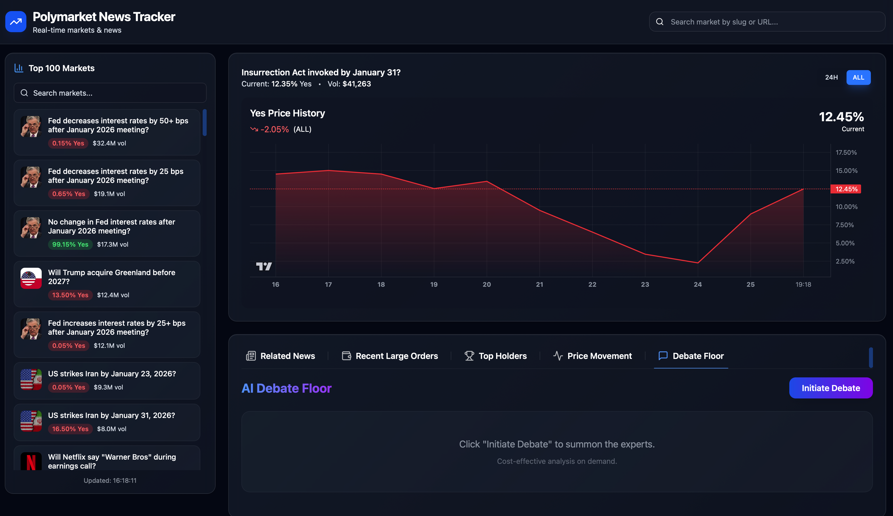
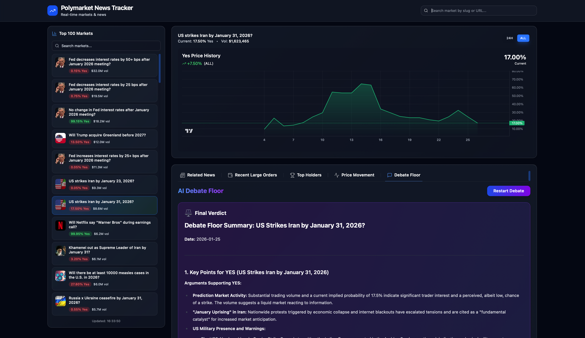
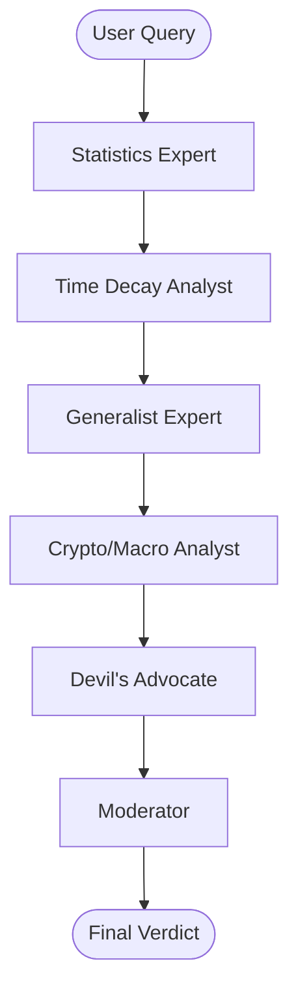
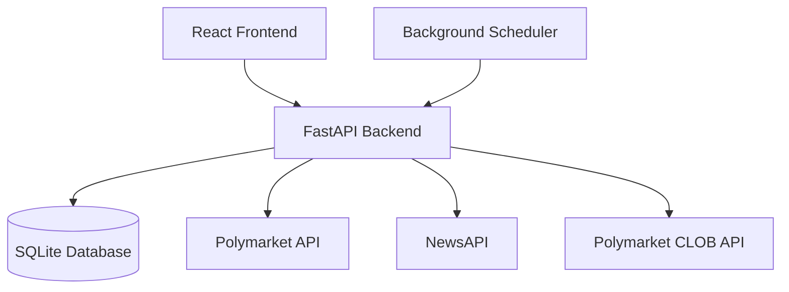

# Polymarket Intelligence

Real-time market tracking dashboard for Polymarket with live price charts, news feeds, whale order tracking, and price movement analysis.


## Quick Start

### Prerequisites

- Python 3.12+
- Node.js 18+
- [uv](https://github.com/astral-sh/uv) package manager

### Installation

1. Clone the repository
   ```bash
   git clone https://github.com/luuisotorres/polymarket-intelligence.git
   cd polymarket-intelligence
   ```

2. Set up environment variables
   ```bash
   cp .env.example .env
   # Edit .env with your API keys
   ```

3. Start both servers
   ```bash
   ./scripts/start.sh
   ```

   Or start them separately:
   ```bash
   # Backend (Terminal 1)
   ./scripts/start_backend.sh

   # Frontend (Terminal 2)
   ./scripts/start_frontend.sh
   ```

4. Open http://localhost:5173

### Quick Start with Docker

Alternatively, run the entire stack with Docker:

```bash
# Build and start containers
docker compose up --build

# Or run in detached mode
docker compose up -d --build
```

Access the app at http://localhost:5173 (frontend) and http://localhost:8000 (backend API).

## Features

### Top 100 Markets Dashboard
Browse the most active Polymarket markets sorted by 7-day trading volume. Each market displays current probability, 24h volume, and price change indicators.

### Live Price Charts
Interactive charts powered by the Polymarket CLOB API showing real-time price history with multiple timeframe options (24H, 7D, 1M, ALL).



### Related News Feed
Aggregated news articles from NewsAPI relevant to selected markets. Stay informed about events that may impact market outcomes.



### Whale Order Tracking
Monitor large trades (orders above $100) in real-time. See bullish and bearish sentiment based on order direction with position sizes and timestamps.



### Top Holders Analysis
View the top 5 holders for each market with their position sizes, percentage ownership, and performance metrics including PnL and ROI.



### Price Movement Analytics
Comprehensive price statistics including:
- 24h/7d price changes and percentages
- High/low ranges for each period
- Volume analysis
- Bullish/Bearish trading signals based on momentum, trend, range position, and volume

## Updates

### February 1, 2026

#### Time Decay & Resolution Analyst
Implemented a new specialized agent for the AI Debate Floor: the **Time Decay & Resolution Analyst**. This agent focuses on the temporal dynamics of prediction markets, calculating time-to-resolution, theta decay factors, and urgency classifications to provide strategic timing recommendations.

---

### January 29, 2026

#### Docker Containerization
The application is now fully containerized with Docker. Run the entire stack (FastAPI backend + React frontend with nginx) using a single `docker compose up --build` command. This simplifies deployment and ensures consistent environments across development and production.

---

### January 25, 2026

#### Search via Market News
Users can now search for markets directly using the market slug or keywords to find relevant news and financial data.



#### AI Debate Floor
Introducing a multi-agent AI debate system where specialized agents analyze the market from different perspectives before reaching a final verdict.



**How it works:**



## Architecture



| Component | Purpose |
|-----------|---------|
| **React Frontend** | Single-page dashboard with Tailwind CSS styling and Zustand state management |
| **FastAPI Backend** | REST API serving market data, news, and analytics |
| **SQLite Database** | Local persistence for market data and caching |
| **Background Scheduler** | APScheduler for periodic market data updates |

## Configuration

| Variable | Description | Default |
|----------|-------------|---------|
| `NEWS_API_KEY` | API key from [NewsAPI](https://newsapi.org) | Required |
| `DATABASE_URL` | SQLite connection string | `sqlite+aiosqlite:///./polymarket.db` |
| `CORS_ORIGINS` | Allowed frontend origins | `http://localhost:5173` |
| `HOST` | Backend server host | `0.0.0.0` |
| `PORT` | Backend server port | `8000` |
| `DEBUG` | Enable debug mode | `true` |
| `POLYMARKET_API_KEY` | Polymarket API Key | Required for trading/auth |
| `POLYMARKET_SECRET` | Polymarket API Secret | Required for trading/auth |
| `POLYMARKET_PASSPHRASE`| Polymarket API Passphrase | Required for trading/auth |
| `GEMINI_API_KEY` | Google Gemini API Key | Required for AI Debate |
| `TAVILY_API_KEY` | Tavily Search API Key | Required for AI Debate |

## API Reference

### Markets

| Endpoint | Description |
|----------|-------------|
| `GET /api/markets/top50` | Get top 100 markets by 7-day volume |
| `GET /api/markets/{id}` | Get single market details |
| `GET /api/markets/{id}/history` | Get price history with timeframe parameter |
| `GET /api/markets/{id}/trades` | Get recent large trades (whale orders) |
| `GET /api/markets/{id}/holders` | Get top holders with PnL and ROI |
| `GET /api/markets/{id}/stats` | Get price statistics and trading signals |
| `GET /api/markets/status` | Get data update status |

### News

| Endpoint | Description |
|----------|-------------|
| `GET /api/news/{market_id}` | Get news articles for a market |

### Health

| Endpoint | Description |
|----------|-------------|
| `GET /api/health` | Health check endpoint |
| `GET /` | API info and documentation links |

## Project Structure

```
Polymarket-News-Tracker/
├── src/
│   ├── backend/
│   │   ├── main.py              # FastAPI application entry point
│   │   ├── config.py            # Configuration from environment
│   │   ├── database.py          # SQLite async database setup
│   │   ├── models.py            # SQLAlchemy models
│   │   ├── routes/
│   │   │   ├── markets.py       # Market data endpoints
│   │   │   └── news.py          # News aggregation endpoints
│   │   ├── polymarket/          # Polymarket API client
│   │   ├── news/                # NewsAPI aggregator
│   │   └── tasks/               # Background scheduler tasks
│   └── frontend/
│       ├── src/
│       │   ├── App.tsx          # Main application component
│       │   ├── components/
│       │   │   ├── MarketList.tsx
│       │   │   ├── PriceChart.tsx
│       │   │   ├── NewsFeed.tsx
│       │   │   ├── WhaleList.tsx
│       │   │   ├── TopHolders.tsx
│       │   │   └── PriceMovement.tsx
│       │   ├── hooks/           # React Query hooks
│       │   └── stores/          # Zustand state stores
│       └── package.json
├── scripts/
│   ├── start.sh                 # Start both servers
│   ├── start_backend.sh         # Start backend only
│   └── start_frontend.sh        # Start frontend only
├── assets/screenshots/          # Application screenshots
├── pyproject.toml               # Python dependencies
└── .env.example                 # Environment template
```

## Tech Stack

### Backend
- **Python 3.12** - Modern Python with async/await
- **FastAPI** - High-performance async web framework
- **SQLAlchemy 2.0** - Async ORM with SQLite
- **APScheduler** - Background task scheduling
- **httpx** - Async HTTP client
- **py-clob-client** - Polymarket CLOB API client
- **LangChain** - LLM Orchestration
- **LangGraph** - Stateful Multi-Agent Workflows

### Frontend
- **React 18** - Component-based UI library
- **Vite** - Fast development build tool
- **TypeScript** - Type-safe JavaScript
- **Tailwind CSS** - Utility-first styling with glassmorphism
- **React Query** - Server state management
- **Zustand** - Client state management
- **Lucide React** - Icon library

## Contributing

1. Fork the repository
2. Create a feature branch (`git checkout -b feature/amazing-feature`)
3. Commit your changes (`git commit -m 'Add amazing feature'`)
4. Push to the branch (`git push origin feature/amazing-feature`)
5. Open a Pull Request


## Author
[Luis Fernando Torres](https://github.com/luuisotorres)

[](https://www.linkedin.com/in/luuisotorres/)
[](https://medium.com/@luuisotorres)
[](https://www.kaggle.com/lusfernandotorres)
[](https://huggingface.co/luisotorres)

## License

MIT
